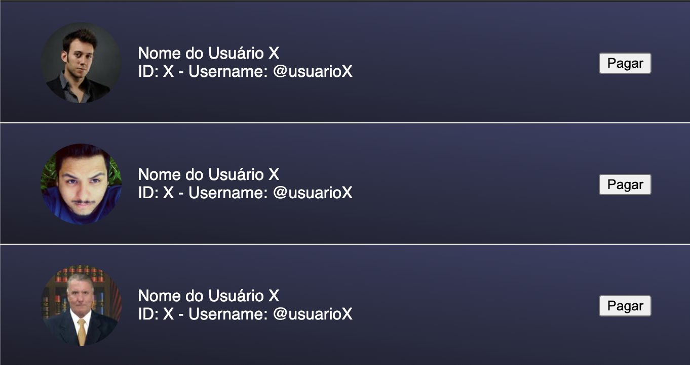
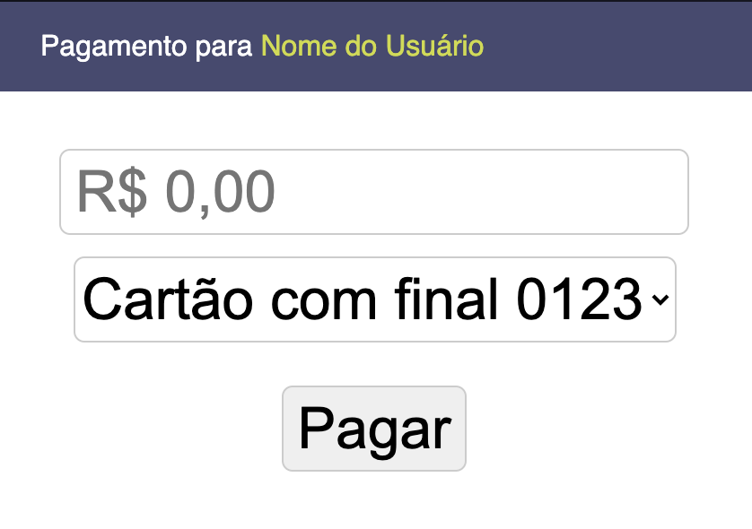
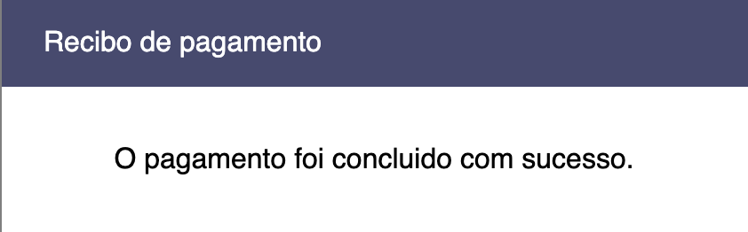
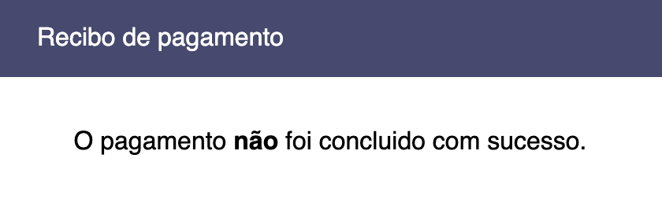

# Desafio Front-end PicPay

Primeiramente, obrigado pelo seu interesse em trabalhar na melhor plataforma de pagamentos do mundo!
Abaixo você encontrará todos as informações necessárias para iniciar o seu teste.

## Avisos antes de começar

- Para a entrega do teste você precisará ter two factor habilitado na sua conta do GitHub, você poderá ver o passo a passo nesse tutorial: https://help.github.com/pt/github/authenticating-to-github/configuring-two-factor-authentication
- Com two factor habilitado, você precisa configurar a chave SSH: https://help.github.com/pt/github/authenticating-to-github/adding-a-new-ssh-key-to-your-github-account
- Para iniciar o teste, crie uma branch a partir da `master` nesse padrão de nomenclatura: dd-mm-yy/nome-sobrenome (por exemplo, 30-04-20/meu-nome)
- Você poderá consultar o Google, Stackoverflow ou algum projeto particular na sua máquina.
- Fique à vontade para perguntar qualquer dúvida aos recrutadores.
- Fique tranquilo, respire, assim como você, também já passamos por essa etapa. Boa sorte! :)

## Setup do projeto

- Angular CLI: 8.3.18
- Node: 10.15.3
- Angular: 8.2.14

## Como Rodar?

- Instale as dependências usando o comando `npm install`
- Na raiz do repositório, rode este comando `ng serve` para iniciar o servidor de desenvolvimento.
- A Aplicação estará disponível na porta `http://localhost:4200/`

## Como submeter?

- Commite suas alterações de forma organizada
- Abra uma pull request da sua branch para a master com a nomenclatura: Nome Sobrenome - dd-mm-yy

## Objetivo

O objetivo é construir uma aplicação que simula o envio de dinheiro para uma outra pessoa, via cartão de crédito.

## Fluxo das telas
Na primeira tela terá uma listagem de usuários, onde a pessoa pode clicar em algum usuário da lista para realizar o pagamento. Quando clicado em um usuário é então aberto um modal de pagamento, contendo as informações do usuário de destino e a opção de selecionar um cartão de crédito. O usuário deve então digitar o valor, escolher o cartão e clicar em pagar. Para realização do pagamento deve-se chamar um endpoint de pagamento que aprovará/recusará a transação. E então deve-se mostrar na tela o modal de pagamento concluído com sucesso ou o de erro.

## Screenshots

### Lista de usuários



### Modal de pagamento e listagem de cartões



### Modal de pagamento concluído com sucesso



### Modal de erro no pagamento



#

## Cartões para exibir

O cartão válido vai aprovar a transação no backend;

```javascript
let cards = [
  // valid card
  {
    card_number: '1111111111111111',
    cvv: 789,
    expiry_date: '01/18',
  },
  // invalid card
  {
    card_number: '4111111111111234',
    cvv: 123,
    expiry_date: '01/20',
  },
];
```

#

## Transação

### Endpoint: https://www.mocky.io/v2/5d542ec72f000048248614b3

### Método: POST

```typescript
// Payload:

interface TransactionPayload {
  // Card Info
  card_number: string;
  cvv: number;
  expiry_date: string;

  // Destination User ID
  destination_user_id: number;

  // Value of the Transaction
  value: number;
}
```

_Obs: Por se tratar de um mock o endpoint sempre retornará o mesmo payload, sucesso no pagamento, independente do cartão_

#

## Usuários

### Endpoint: https://www.mocky.io/v2/5d531c4f2e0000620081ddce

### Método: GET

```typescript
// Payload:

interface User {
  id: number;
  name: string;
  img: string;
  username: string;
}
```

#

## Diferenciais

- Teste unitário / E2E
- Melhoria no estilo da aplicação
- Validação de formulários e máscaras
- Organização do código

#

Estamos sempre em busca de melhoria, por isso, caso tenha alguma sugestão fique a vontade pra compartilhar com a gente!

Mais uma vez, boa sorte! :green_heart:
